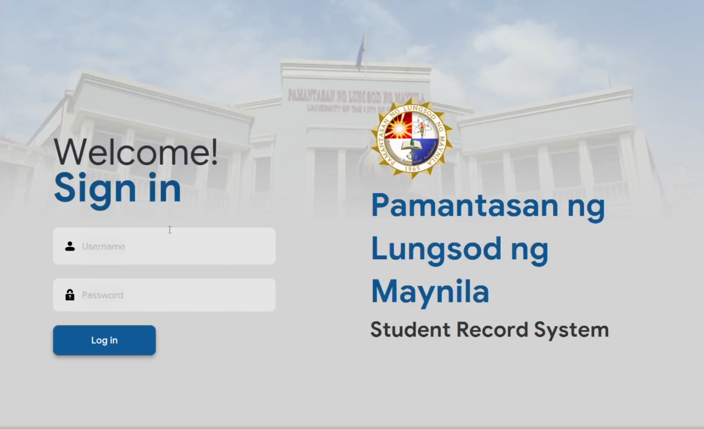
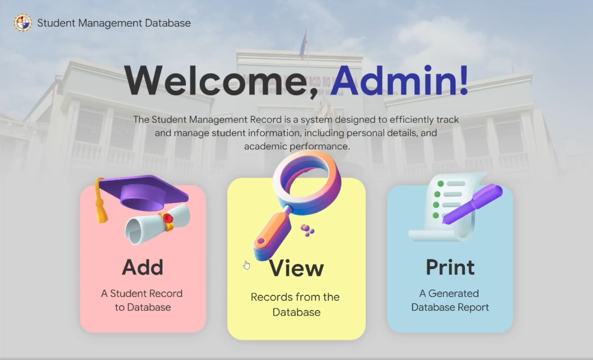

# Freshman - Student Record Administration System

## 💡 About the Project

The Student Record Administration System is specifically designed to gather, store, and retrieve the student records of the Computer Science Department at PLM. It allows administrators to add, modify, delete, search, and sort student information within the student database.

  
  

### **⚙ Tools and Technologies Used**

1. **Java** - The main programming language used for the backend and application logic.
2. **JavaFX** - Used for building the graphical user interface (UI), including controls, FXML, web, 
5. **MySQL** - Database used for storing application data via MySQL Database (Project Requirement).
6. **JasperReports** - Used for generating reports.

## ❗❗ Disclaimer

This project was made as part of the final requirement for Intermediate Programming class at Pamantasan ng Lungsod ng Maynila. It is for learning purposes only and not meant for real-world or production use. This was a one-time submission and may not update or maintain this project regularly.

## 👥 Developers

<b>20232 BSCS 1-1

<b>LEADER: LAU, Trisha

-   CATACUTAN, Raphael James C.
-   CORALES, Charliz Dana
-   CRUZ, Joshua
-   OLIVERIO, Brenan
-   MULLENO, Jeshaia